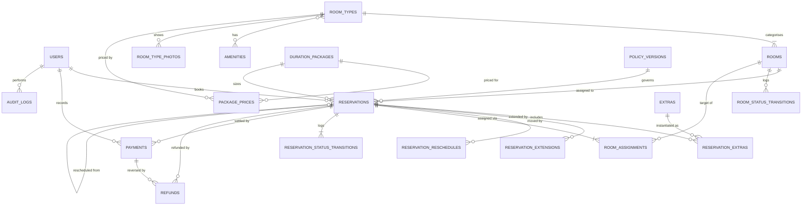

# Deliverable 1 — Entity Relationship Model

Single-hotel reservation and management system. Interval-based booking (3/6/12/22-hour packages), physical room assigned at booking, turnover buffer, downpayment/balance payments, tiered refunds.

Status: **implemented**. This document is the design record; the schema it describes is
live in `database/migrations`, and the reasoning behind each mechanism now also sits
alongside the code that implements it. Where the two ever disagree, the migrations are the
truth.

The three open questions in section 7 were answered as follows, and each answer is
documented at the point it takes effect:

1. **Currency** — one fixed currency for the property (`HOTEL_CURRENCY`, default `PHP`).
   The `currency` columns are still carried on every row, so a second currency would be a
   change of behaviour rather than a change of schema.
2. **The unpaid hold applies only to the online path.** An at-property booking has no
   payment by definition, so applying the hold would expire every one of them; those are
   confirmed immediately and protected by the no-show grace period instead. See
   `PaymentMode::takesUnpaidHold()`.
3. **Staff and admin accounts cannot hold reservations as customers.** `role` stays
   single-valued.

Deferred, and still worth a decision: the `room_blocks` table for *scheduled* maintenance
(section 6, item 3). Rooms can currently only be taken out of service immediately and
open-endedly.

---

## 1. Modelling conventions

| Concern | Decision | Reason |
|---|---|---|
| **Money** | `bigInteger` minor units (`*_cents`), never float or decimal-as-float. `currency` char(3) snapshotted on the reservation. | Exact arithmetic on both SQLite and PostgreSQL; no rounding drift across downpayment/refund splits. |
| **Time** | All datetimes stored UTC. Hotel-local timezone is a setting. `starts_at` constrained to minute = 0 and second = 0. | Packages start on the hour; DST and reporting need a fixed storage zone. |
| **Interval representation** | Half-open `[starts_at, ends_at)`. A reservation ending 14:00 and one starting 14:00 do **not** overlap. | Removes boundary ambiguity from every comparison in deliverable 2. |
| **Buffer representation** | `blocked_until` is a **stored, application-maintained column** equal to `ends_at + buffer_minutes`. | The PostgreSQL exclusion constraint needs a real column to build a `tstzrange` over. A virtual/computed column is not portable to SQLite, and expression indexes differ between engines. |
| **Snapshotting** | Every price, rate, name and policy figure the customer agreed to is **copied onto the reservation row** at the moment of agreement. Catalogue rows hold current values only. | "The policy applied is the one in force when the booking was made", plus admins may edit prices and disable extras without corrupting history. |
| **Deletion** | Catalogue entities (`extras`, `room_types`, `rooms`, `duration_packages`) are **deactivated** via `is_active`, never deleted. `users` soft-delete. Transactional rows are never deleted. | Historical reservations must keep resolving their references. |
| **Roles** | One `users` table with a `role` enum (`customer`, `staff`, `admin`), not separate tables. | Every actor FK (`recorded_by_user_id`, `decided_by_user_id`, …) then targets one table; policies and gates key off one column. |
| **Attribution** | Any row written by a human carries a nullable `*_by_user_id`. `NULL` means the scheduler/system did it. | Staff and admin actions must be attributable; expiry and no-show marking are system-initiated. |
| **Enums** | Stored as `string` columns with a CHECK constraint, cast to PHP enums in Eloquent. | Native `ENUM` types do not exist in SQLite and are painful to alter in PostgreSQL. |

---

## 2. Entity catalogue

### 2.1 Identity and access

#### `users`

| Column | Type | Notes |
|---|---|---|
| `id` | bigint PK | |
| `name` | string | |
| `email` | string | unique |
| `email_verified_at` | timestamp null | |
| `password` | string | bcrypt/argon hash; never recoverable |
| `phone` | string null | |
| `role` | string | `customer` / `staff` / `admin` |
| `is_active` | boolean | staff offboarding without destroying attribution |
| `address_line`, `city`, `country`, `postal_code` | string null | customer profile fields, nullable for staff |
| `last_login_at` | timestamp null | |
| `remember_token`, timestamps, `deleted_at` | | soft delete |

Laravel's `password_reset_tokens` and `sessions` tables exist but are framework infrastructure and are not modelled here.

### 2.2 Catalogue and physical inventory

#### `room_types`

`id`, `name`, `slug` (unique), `description` (text), `base_occupancy` (int), `max_occupancy` (int), `bed_configuration` (string), `size_sqm` (int null), `extension_hourly_rate_cents` (bigint), `sort_order` (int), `is_active` (bool), timestamps.

The extension rate lives here because it is inherently per-room-type; it is snapshotted onto each granted extension.

#### `amenities`

`id`, `name`, `slug` (unique), `icon` (string null), `description` (string null), `is_active`, timestamps.

#### `amenity_room_type` (pivot)

`room_type_id`, `amenity_id`. Composite PK. No payload.

#### `room_type_photos`

`id`, `room_type_id` FK, `path`, `alt_text` (string null), `sort_order`, `is_cover` (bool), timestamps. One cover per room type, enforced in the application for cross-engine parity.

#### `rooms` — physical rooms

| Column | Type | Notes |
|---|---|---|
| `id` | bigint PK | |
| `room_type_id` | FK → room_types | restrict on delete |
| `number` | string | unique, e.g. `304` |
| `floor` | int null | |
| `status` | string | `available` / `reserved` / `occupied` / `cleaning` / `out_of_service` |
| `is_bookable` | boolean | admin kill-switch, independent of `status` |
| `notes` | text null | |
| timestamps | | |

**Critical distinction:** `rooms.status` is the *present-tense housekeeping state of the physical room*. It is **not** the source of truth for availability over time. Availability for a future window is derived entirely from `reservations` rows. A room whose status is `occupied` right now is still bookable for next Tuesday. Only `cleaning`, `out_of_service`, and `is_bookable = false` affect *immediate* assignment. Deliverable 3 makes this boundary explicit.

### 2.3 Pricing and policy

#### `duration_packages`

`id`, `hours` (int, unique — 3, 6, 12, 22), `name` (e.g. "6-hour stay"), `sort_order`, `is_active`, timestamps.

Held as data rather than a hard-coded enum so admins can add a package later without a migration; `hours` drives `ends_at = starts_at + hours`.

#### `package_prices`

`id`, `room_type_id` FK, `duration_package_id` FK, `price_cents` (bigint), `currency`, `is_active`, timestamps. **Unique `(room_type_id, duration_package_id)`.**

Holds the *current* price grid only. Historical prices live on reservations as snapshots, so no effective-dating is needed here.

#### `extras`

`id`, `name`, `description` (text null), `price_cents`, `pricing_basis` (`per_booking` / `per_hour` / `per_person`), `is_active`, `sort_order`, timestamps.

Disabling sets `is_active = false`; existing `reservation_extras` rows are unaffected because they carry their own name/price/basis snapshot.

#### `policy_versions`

The heart of "the policy in force when the booking was made".

| Column | Type | Notes |
|---|---|---|
| `id` | bigint PK | |
| `version` | int | unique, monotonically increasing |
| `turnover_buffer_minutes` | int | default 60 |
| `unpaid_hold_minutes` | int | default 30 |
| `downpayment_percent` | int | default 50 |
| `full_refund_hours_before` | int | default 24 |
| `partial_refund_hours_before` | int | default 6 |
| `no_show_grace_minutes` | int | default 60 |
| `free_reschedule_hours_before` | int | default 24 |
| `tax_percent_bp` | int | basis points, e.g. 1200 = 12% |
| `service_fee_cents` | bigint | fixed per-booking fee, may be 0 |
| `effective_from` | timestamp | |
| `is_current` | boolean | exactly one row true |
| `created_by_user_id` | FK → users null | which admin published it |
| timestamps | | |

Admin edits **never update a row** — they insert a new version and flip `is_current`. Every reservation stores `policy_version_id`, so its cancellation tiers, downpayment percentage and no-show grace are frozen at booking. This also means changing the turnover buffer does not retroactively invalidate existing reservations' `blocked_until` values.

#### `settings`

Single-row table for non-policy configuration: `hotel_name`, `timezone`, `currency`, `contact_email`, `contact_phone`, `checkin_instructions`, timestamps. Deliberately separate from `policy_versions` because these are not versioned and carry no financial meaning.

### 2.4 Reservation core

#### `reservations`

| Column | Type | Notes |
|---|---|---|
| `id` | bigint PK | |
| `reference` | string | unique, human-quotable (e.g. `BL-7K3QD2`) |
| `user_id` | FK → users null | NULL for walk-in/phone guests with no account |
| `guest_name`, `guest_email`, `guest_phone` | string null | contact snapshot; required when `user_id` is NULL |
| `created_by_user_id` | FK → users null | staff member for walk-in/phone; NULL for self-service |
| `channel` | string | `online` / `walk_in` / `phone` |
| `room_type_id` | FK → room_types | what was booked and priced |
| `room_id` | FK → rooms | **NOT NULL** — physical room assigned at booking |
| `duration_package_id` | FK → duration_packages | |
| `package_hours` | int | snapshot |
| `starts_at` | timestamp | on the hour |
| `ends_at` | timestamp | `starts_at + package_hours`, plus granted extensions |
| `buffer_minutes` | int | snapshot from the policy version |
| `blocked_until` | timestamp | `ends_at + buffer_minutes`; the column the exclusion constraint ranges over |
| `adults`, `children` | int | drives `per_person` extras |
| `status` | string | `pending` / `confirmed` / `checked_in` / `checked_out` / `cancelled` / `no_show` / `expired` |
| `payment_mode` | string | `online` / `at_property` |
| `payment_status` | string | `unpaid` / `partially_paid` / `paid_in_full` / `refunded` / `partially_refunded` |
| `policy_version_id` | FK → policy_versions | the frozen policy |
| `package_price_cents` | bigint | snapshot |
| `extras_total_cents` | bigint | roll-up of `reservation_extras` |
| `extensions_total_cents` | bigint | roll-up of approved extensions |
| `discount_total_cents` | bigint | |
| `tax_total_cents` | bigint | |
| `fees_total_cents` | bigint | |
| `total_cents` | bigint | the agreed total |
| `amount_paid_cents` | bigint | roll-up of succeeded payments |
| `amount_refunded_cents` | bigint | roll-up of completed refunds |
| `balance_due_cents` | bigint | `total - paid + refunded` |
| `currency` | char(3) | |
| `hold_expires_at` | timestamp null | set on `pending`, consumed by the scheduler |
| `confirmed_at`, `checked_in_at`, `checked_out_at`, `cancelled_at`, `no_show_at` | timestamp null | |
| `cancelled_by_user_id` | FK → users null | NULL = system |
| `cancellation_initiator` | string null | `customer` / `hotel` / `system` — decides refund tier vs. full refund |
| `reschedule_count` | int | free-reschedule entitlement tracking |
| `rescheduled_from_id` | FK → reservations null | self-reference when reschedule was a cancel + rebook |
| `customer_notes`, `internal_notes` | text null | internal notes are staff-visible only |
| timestamps | | |

The money columns are roll-ups maintained inside the same transaction as the payment, extra or extension rows that change them. `payments` and `refunds` remain the ledger of record; the roll-ups exist so the availability and daily-board screens do not aggregate on every render. Deliverable 4 specifies the invariants that must hold between them.

#### `reservation_extras`

`id`, `reservation_id` FK (cascade), `extra_id` FK (restrict), `name_snapshot`, `unit_price_cents_snapshot`, `pricing_basis_snapshot`, `quantity` (int), `hours` (int null), `persons` (int null), `line_total_cents`, `added_by_user_id` FK null, `added_at`, timestamps.

`hours` and `persons` are captured because a `per_hour` extra added mid-stay may cover fewer hours than the package, and a `per_person` extra must not silently re-price if the guest count is edited later.

#### `reservation_extensions`

`id`, `reservation_id` FK, `requested_by_user_id` FK null, `decided_by_user_id` FK null, `additional_hours` (int), `previous_ends_at`, `new_ends_at`, `hourly_rate_cents_snapshot`, `charge_cents`, `status` (`requested` / `approved` / `refused`), `refusal_reason` (string null), `requested_at`, `decided_at` (null), timestamps.

Refused extensions are retained — the audit requirement covers refusals, and the record explains why a guest was told no.

#### `reservation_reschedules`

`id`, `reservation_id` FK, `from_starts_at`, `from_ends_at`, `from_room_id` FK, `to_starts_at`, `to_ends_at`, `to_room_id` FK, `was_free` (bool), `performed_by_user_id` FK null, timestamps.

Present only for in-place reschedules (the free path). The cancel-and-rebook path is represented by `reservations.rescheduled_from_id` instead.

#### `room_assignments`

`id`, `reservation_id` FK, `from_room_id` FK null (NULL = initial assignment), `to_room_id` FK, `reason` (string null), `changed_by_user_id` FK null, `created_at`.

Append-only. `reservations.room_id` is the current assignment; this is the history of how it got there.

#### `reservation_status_transitions`

`id`, `reservation_id` FK, `from_status` (string null — NULL on creation), `to_status`, `actor_user_id` FK null, `actor_role` (string null), `reason` (string null), `context` (json null), `created_at`.

Satisfies "every transition records actor and timestamp". Append-only, never updated.

#### `room_status_transitions`

`id`, `room_id` FK, `from_status`, `to_status`, `reservation_id` FK null (the reservation that caused it), `actor_user_id` FK null, `created_at`. Append-only.

### 2.5 Payments

#### `payments`

| Column | Type | Notes |
|---|---|---|
| `id` | bigint PK | |
| `reservation_id` | FK → reservations | |
| `kind` | string | `downpayment` / `balance` / `full` / `extension` / `extra` |
| `channel` | string | `online` / `at_property` |
| `method` | string | `mock_gateway` / `cash` / `card_terminal` / `bank_transfer` |
| `amount_cents` | bigint | positive |
| `currency` | char(3) | |
| `status` | string | `pending` / `succeeded` / `failed` / `cancelled` / `expired` |
| `provider` | string null | e.g. `mock` — set only for online |
| `provider_reference` | string null | unique when present; the gateway's id |
| `provider_payload` | json null | raw callback body, for reconciliation |
| `idempotency_key` | string | unique; guards double-submits and duplicate callbacks |
| `recorded_by_user_id` | FK → users null | **required for `at_property`** — attribution of face-to-face payments |
| `initiated_at`, `paid_at`, `failed_at` | timestamp null | |
| timestamps | | |

`status = pending` with a `provider_reference` is exactly the redirect-checkout in-flight state: the guest has left for the gateway and has not come back yet. Card data never lands in any column here.

#### `refunds`

`id`, `reservation_id` FK, `payment_id` FK null (the payment being reversed; NULL for a manual cash refund at the desk), `amount_cents`, `currency`, `reason` (`customer_cancellation` / `hotel_cancellation` / `reschedule` / `overpayment` / `goodwill`), `tier_applied` (string null — `full` / `downpayment_forfeited` / `none`), `status` (`pending` / `succeeded` / `failed`), `method`, `provider_reference` (string null), `processed_by_user_id` FK null, `processed_at` (timestamp null), `notes`, timestamps.

Kept separate from `payments` rather than modelled as a signed-amount ledger, because refunds carry fields payments do not (`tier_applied`, `reason`, the payment they reverse) and because "amount paid" and "amount refunded" are reported separately.

### 2.6 Audit

#### `audit_logs`

`id`, `actor_user_id` FK null, `actor_role` (string null), `action` (string, e.g. `reservation.room_reassigned`), `auditable_type` + `auditable_id` (polymorphic), `before` (json null), `after` (json null), `ip_address`, `user_agent`, `created_at`.

Catch-all for staff and admin actions that are not status transitions — price changes, policy publication, extra definitions, staff account changes. Append-only, retained indefinitely.

The two `*_status_transitions` tables are deliberately **not** folded into this: they are queried on the operational hot path (daily board, reservation timeline) and need typed columns and their own indexes.

---

## 3. Relationships

| From | To | Cardinality | Delete rule |
|---|---|---|---|
| users | reservations (as customer) | 1 → 0..n | restrict — soft-delete users instead |
| users | reservations (as creator) | 1 → 0..n | restrict |
| room_types | rooms | 1 → 1..n | restrict |
| room_types | amenities | n ↔ n via `amenity_room_type` | cascade on pivot |
| room_types | room_type_photos | 1 → 0..n | cascade |
| room_types | package_prices | 1 → 0..n | cascade |
| duration_packages | package_prices | 1 → 0..n | restrict |
| rooms | reservations | 1 → 0..n | restrict |
| duration_packages | reservations | 1 → 0..n | restrict |
| policy_versions | reservations | 1 → 0..n | restrict |
| reservations | reservation_extras | 1 → 0..n | cascade |
| extras | reservation_extras | 1 → 0..n | restrict |
| reservations | reservation_extensions | 1 → 0..n | cascade |
| reservations | reservation_reschedules | 1 → 0..n | cascade |
| reservations | room_assignments | 1 → 1..n | cascade |
| reservations | reservation_status_transitions | 1 → 1..n | cascade |
| rooms | room_status_transitions | 1 → 0..n | cascade |
| reservations | payments | 1 → 0..n | restrict |
| reservations | refunds | 1 → 0..n | restrict |
| payments | refunds | 1 → 0..n | set null |
| reservations | reservations (`rescheduled_from_id`) | 0..1 → 0..1 | set null |
| users | payments (`recorded_by_user_id`) | 1 → 0..n | restrict |
| users | audit_logs | 1 → 0..n | set null |

Two of these deserve a note:

- **`reservations` → `rooms` is restrict, not cascade.** A physical room can never be deleted once it has history; it is deactivated.
- **`payments` → `refunds` is set null.** A cash refund at the desk may not correspond to any single recorded payment.

---

## 4. Diagram



---

## 5. Constraints and indexes

### 5.1 The overlap guarantee

The schema is shaped so that this constraint can be added to PostgreSQL at deployment **without any application change**:

```sql
CREATE EXTENSION IF NOT EXISTS btree_gist;

ALTER TABLE reservations
  ADD CONSTRAINT reservations_no_overlap
  EXCLUDE USING gist (
    room_id WITH =,
    tstzrange(starts_at, blocked_until, '[)') WITH &&
  )
  WHERE (status IN ('pending', 'confirmed', 'checked_in'));
```

Three schema decisions exist purely to make this possible and correct:

1. `blocked_until` is a **real stored column**, so the range is built over columns rather than an expression the application would have to keep in sync separately.
2. The range is half-open `[)`, matching the application's comparison semantics exactly — otherwise back-to-back reservations would be rejected by the database but accepted by the application, or the reverse.
3. The constraint is **partial**. `cancelled`, `no_show`, `expired` and `checked_out` reservations keep their `room_id` and datetimes for history and reporting, but must not block the slot. The status list in the `WHERE` clause is the single definition of "occupies the room", and deliverable 3's state machine will be written against that same list.

SQLite has no equivalent, so locally the guarantee is the transaction described in deliverable 2. The constraint is a second line of defence in production, not the primary mechanism — the application logic must be correct on its own.

### 5.2 Indexes

| Table | Index | Purpose |
|---|---|---|
| reservations | `(room_id, starts_at, blocked_until)` | the availability scan |
| reservations | `(status, hold_expires_at)` | scheduler: expire unpaid pending holds |
| reservations | `(status, starts_at)` | scheduler: no-show sweep; staff daily board |
| reservations | `(user_id, starts_at, ends_at)` | customer duplicate-booking check |
| reservations | `reference` unique | lookup by quoted code |
| reservations | `(room_type_id, starts_at)` | search: which rooms of a type are free |
| payments | `idempotency_key` unique | duplicate-submit and duplicate-callback guard |
| payments | `provider_reference` unique, nullable | gateway callback resolution |
| payments | `(reservation_id, status)` | balance roll-up |
| reservation_status_transitions | `(reservation_id, created_at)` | timeline |
| audit_logs | `(auditable_type, auditable_id, created_at)` | per-record audit trail |

### 5.3 CHECK constraints, portable to both engines

- `reservations`: `ends_at > starts_at`, `blocked_until >= ends_at`, `total_cents >= 0`, `amount_paid_cents >= 0`, `adults >= 1`.
- `reservations`: `starts_at` falls on the hour. `strftime` and `EXTRACT` differ between engines, so this is enforced in the application and asserted by a per-driver check written in the migration, as the stack brief requires.
- `payments`: `amount_cents > 0`.
- `refunds`: `amount_cents > 0`.
- `policy_versions`: `downpayment_percent BETWEEN 1 AND 100`, `full_refund_hours_before > partial_refund_hours_before`.
- Guest identity: `user_id IS NOT NULL OR guest_name IS NOT NULL` — a reservation always has someone attached to it.

---

## 6. Deliberate choices worth challenging

1. **Walk-ins do not get user accounts.** `reservations.user_id` is nullable and guest contact details are stored inline. The alternative is auto-provisioning a shell `users` row for every phone booking. I chose nullable because shell accounts pollute the customer list and complicate the "customer cannot double-book" rule — an anonymous walk-in has no identity to check against. Consequence: that rule applies to account holders only, and staff creating a walk-in are shown a name/phone match warning rather than a hard block.

2. **`room_type_id` is stored on the reservation alongside `room_id`.** Redundant while the room's type is unchanged, but a room can be reclassified, and the guest paid for the type they booked. The reservation's own copy is what pricing and reporting use.

3. **No `room_blocks` table for maintenance.** Taking a room out of service for a window is currently only expressible as `status = out_of_service` — immediate and open-ended, not scheduled. If you need "room 304 is out for refurbishment next Tuesday", that is a new entity which must participate in the same overlap logic and the same exclusion constraint. **Say the word and I will add it before we move on** — retrofitting it after the availability algorithm is agreed is considerably more expensive.

4. **Denormalised money roll-ups on `reservations`.** Faster boards and reports, at the cost of an invariant that must hold. Deliverable 4 defines that invariant and where it is recomputed. The alternative — always aggregating `payments` — is safer but makes the staff daily board and the admin revenue report noticeably heavier.

5. **Taxes and fees are two scalar fields on `policy_versions`, not a `tax_rules` table.** Adequate for a single hotel in one jurisdiction. If you need multiple named tax lines on an invoice, that becomes a table plus `reservation_tax_lines`.

---

## 7. Open questions

None of these block agreement on the model, but all three change deliverables 2–4.

1. **Currency** — single fixed currency for the property, or must the model carry more than one? The schema carries `currency` columns either way; the question is whether conversion ever happens.

2. **Does the unpaid hold apply to at-property bookings?** The lifecycle says a pending reservation *with no payment* expires after 30 minutes. An `at_property` booking has no payment by definition, so taken literally every such booking would expire. This changes what `hold_expires_at` is set to, and it is the first thing deliverable 3 has to resolve.

3. **Can staff and admin accounts also hold reservations as customers?** Currently `role` is single-valued, so no. If yes, roles become a pivot table.
